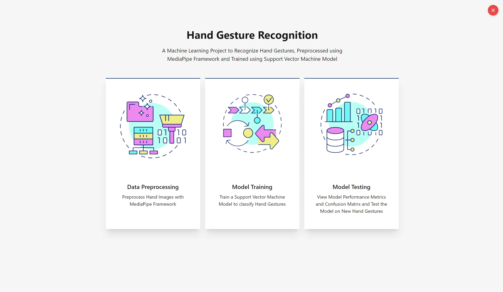
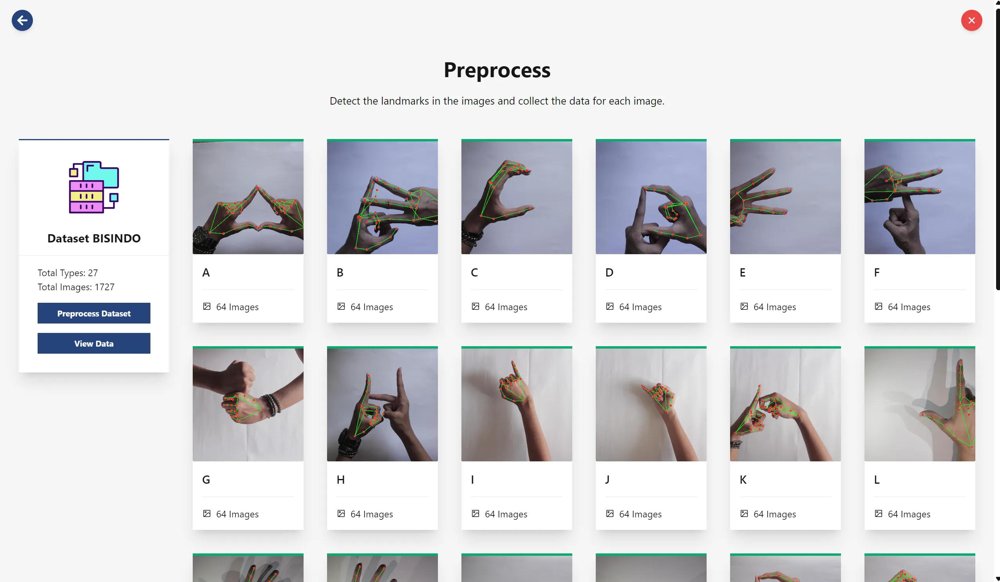
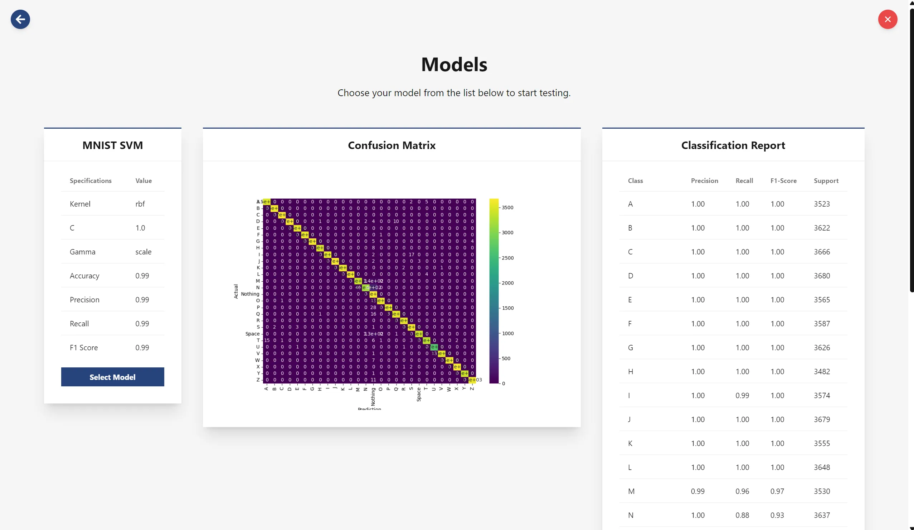
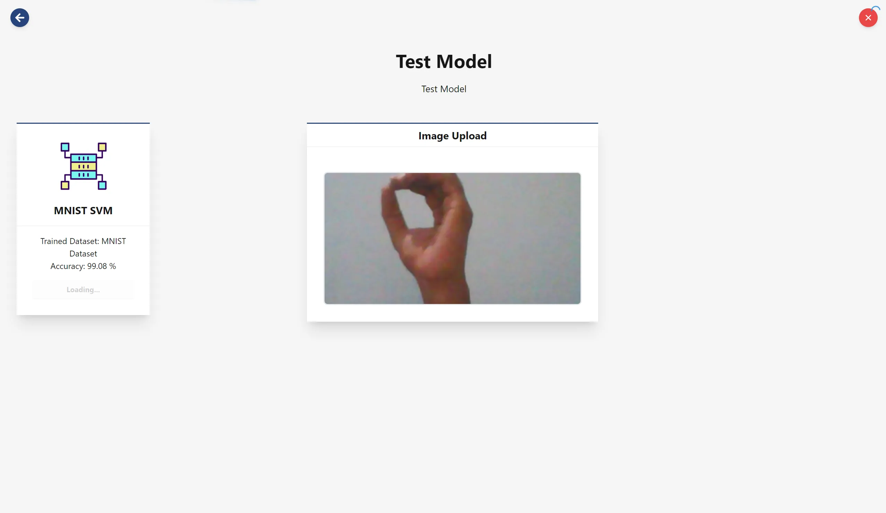

<h1 align="center">Tauri Hand Gesture Recognition Application</h1>

A desktop application used to train hand gesture recognition machine learning models built using Svelte, Python and Tauri. 
The application allows users to train a machine learning model of their choosing using a dataset of hand gesture images.

## Features

- Interactive UI for training machine learning models built using Svelte and Tauri
- Integration with Google MediaPipe for hand gesture recognition
- Integration with Python for training machine learning models
- Realtime dataset testing using trained models

## Pre-requisites

1. Node.js
2. PNPM
3. Python 3.11
4. Rust
5. Microsoft C++ Build Tools
6. WebView2 Runtime
7. Rust

## Getting Started (for Windows)

1. Run command ``git clone https://github.com/robert-wl/tauri-hand-gesture-recognition.git`` to clone the repository
2. Navigate to the project directory by running command ``cd tauri-hand-gesture-recognition``
3. Run command ``pnpm install`` to install the project dependencies
4. Navigate to the Tauri project directory by running command ``cd src-tauri``
5. Create a virtual environment by running command ``python -m venv .venv``
6. Activate the virtual environment by running command ``.\.venv\Scripts\activate``
7. Install the Python dependencies by running command ``pip install -r requirements.txt``
8. Exit the virtual environment by running command ``deactivate``
9. Start the application by running command ``pnpm tauri dev``

## Screenshots

Home Page

Training + Preprocess Page

Evaluation Page

Model Testing Page

